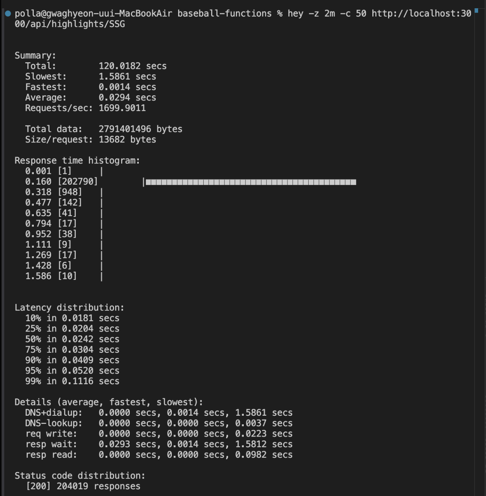
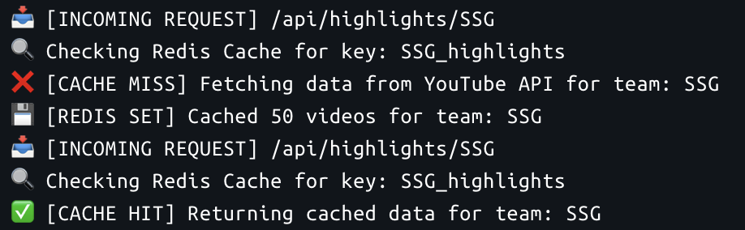

# ⚾ 누구나 야구를 - 야구 응원가 업로드 및 스트리밍 앱

> 야구팀 팬들을 위한 **응원가 공유 및 스트리밍 플랫폼**  
> mp3 → HLS 변환, Firebase 기반 백엔드, 뉴스 연동까지 포함된 **iOS 프로젝트**

---

## 📱 소개

“누구나 야구를”은 야구팀 팬들을 위한 **응원가 스트리밍 앱**입니다.  
사용자는 팀을 선택하고, 응원가를 **업로드하거나 감상**할 수 있으며, 팀 관련 뉴스를 실시간으로 확인할 수 있습니다.

- 🎶 **응원가 업로드 및 스트리밍 (HLS 기반)**
- 📰 **Google 뉴스 RSS를 이용한 팀별 뉴스 수집**
- 🔐 **Firebase 인증 및 실시간 데이터 연동**
- 🚀 **50명 동시 접속 부하 테스트 성공**

---

## 🧑‍💻 개발 정보

- **기간**: 2025.01.01 ~ 2025.06.20  
- **인원**: 1인 개발  
- **아키텍처**: MVVM + Firebase + Proxy Server (Node.js)

---

## 🧩 핵심 기능

| 기능 | 설명 |
|------|------|
| 사용자 인증 | 로그인/회원가입 기능, OAuth2 기능 |
| 응원가 업로드 | mp3 업로드 → ffmpegkit으로 HLS 변환 후 업로드 |
| 스트리밍 재생 | AVPlayer로 .m3u8 파일 스트리밍 |
| 뉴스 수집 | Google RSS Feed 파싱 → 팀별 뉴스 표시 |
| 좋아요 및 보관함 | 유저별 좋아요한 응원가 저장 및 관리 |
| 부하 테스트 | `hey`를 통한 50명 동시 요청 테스트 성공 |

---

## 🛠 사용 기술 스택

### 📱 iOS
- SwiftUI / Combine / Concurrency
- MediaPlayer, NotificationCenter
- AVFoundation + AVPlayer (.m3u8 스트리밍)

### ☁️ Firebase (Backend)
- Firebase Auth (사용자 인증)
- Firestore (팀, 유저, 응원가 데이터)
- Firebase Storage (.m3u8, .ts 파일 저장)
- Firebase Functions (자동 업로드 처리)

### 🌐 서버 및 인프라
- Node.js (Proxy Server)
- ffmpegkit (mp3 → HLS 변환)
- Docker, Docker Compose

---

## 🎥 시연

> [누구나 야구를 Notion 링크](https://www.notion.so/1dcc08ecd4d280589a77e173f05c21c9?pvs=21](https://www.notion.so/iOS-1d8c08ecd4d2801e817ee62f4336e1b8?p=1dcc08ecd4d280589a77e173f05c21c9&pm=c))

---

<h3>📊 성능 테스트 결과</h3>

  <strong>1️⃣ Hey 부하 테스트 결과 (50명 동시 요청)</strong> 
  
  
  <strong>2️⃣ Proxy-Server Cache 반환 결과</strong> 
  

---

## 📚 배우고 느낀 점
- Combine과 Concurrency를 통한 비동기 처리 학습
- URLSession을 통한 외부 서버 연결
- ffmpegkit을 활용한 기존 Download 방식을 HLS 전환
- Google RSS Feed를 활용한 구글 뉴스 XML Parser
- MediaPlayer를 활용한 백그라운드 재생 및 NotificationCenter에 대한 학습
- SwiftUI의 상태관리 및 데이터 관리
- Node.js를 활용한 Proxy-Server 구축
- Docker-compose를 활용한 서버 구축 

